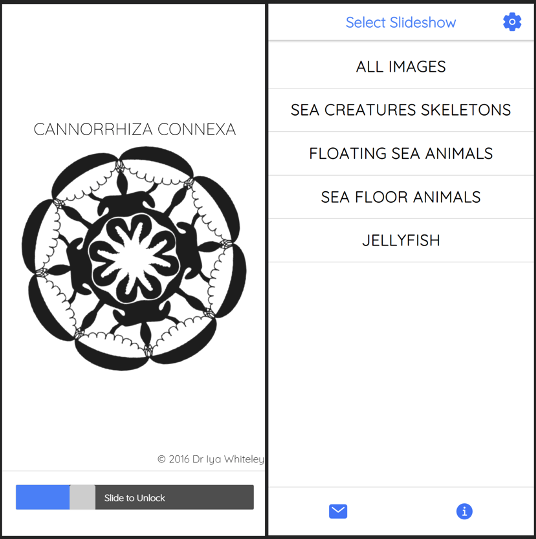

## Newborn Baby App

**What does this application do and why?**

Our app features Dr Iya Whiteley’s research-informed black and white development images from Cosmic Baby Books. The app displays slideshows (with accompanying audio narration) to newborn babies in order to:

* Aid with the physiological development of their eyes and brain
* Calm them quickly
* Entertain and engage them
* Enable parents to take a break



In the browser, the client is able to upload new images, audios, music and slideshows for users to view on the mobile app. 

On the mobile app, users can: 

* Sign up through an email form to hear updates about Cosmic Baby Books
* Adjust the audio and visual settings, based on the age of their baby
* Read about Dr Iya Whiteley and the science behind her work

**How the application is organised**

Newborn Baby App is divided into the following folders:

* backend - contains the code for the client website hosted on Azure
* public - contains the code for components and pages displayed on the mobile app
* src - contains the Ionic code which supports the mobile app
* build - contains the production code for the mobile app
* ios - contains the code for the mobile app for iOS devices (i.e., iPhone, iPad)
* android - contains the code for the mobile app for Android devices (i.e., Galaxy S5, Surface Duo) 
* gitignore - instructs GitHub to omit any extraneous files, such as node modules

**Step-by-Step on how to run the application**

First clone this application repository to your computer. Open your terminal and navigate to where you would like to download the source code. Then for SSH, type:

```js
git clone git@github.com:UCLComputerScience/COMP0067_2021_Team16.git
```

Or for HTTPS, type:

```js
git clone https://github.com/UCLComputerScience/COMP0067_2021_Team16.git
```

Now that you have downloaded the application to your computer, navigate to the root folder and type:

```js
npm install
```

After installation, type in the terminal:

```js
ionic serve
```

In a few seconds, the mobile application will begin running in your default browser. Be sure to adjust the width of the browser to represent your preferred mobile device. 

If you would like to install the mobile application directly onto your device, please do get in touch with the developrs - our contact details are provided below.

**Links to deployed version of client site**

* Azure Client Site: https://0067team16app.azurewebsites.net/
* GitHub Repository: https://github.com/UCLComputerScience/COMP0067_2021_Team16

**Technologies Used** 

* Ionic
* Capacitor
* Cordova
* React.js
* Node.js
* Express
* mySQL
* mySQL Workbench
* REST API Routes
* HTML
* CSS
* Sass
* Typescript
* TSUN
* jQuery
* Axios
* Google Analytics
* Azure Containers
* Azure Blob Storage
* HTML Storage
* Launch image and icon implementation
* Postman
* XCode
* Android Studio
* Chrome DevTools

**Developers** 

* Caroline Crandell - cecrandell - caroline.crandell.20@ucl.ac.uk 
* Giuseppe Baldini - GiuseppeBaldini - giuseppe.baldini.20@ucl.ac.uk 
* Chenuka Ratwatte - ucabcnd - chenuka.ratwatte.20@ucl.ac.uk 